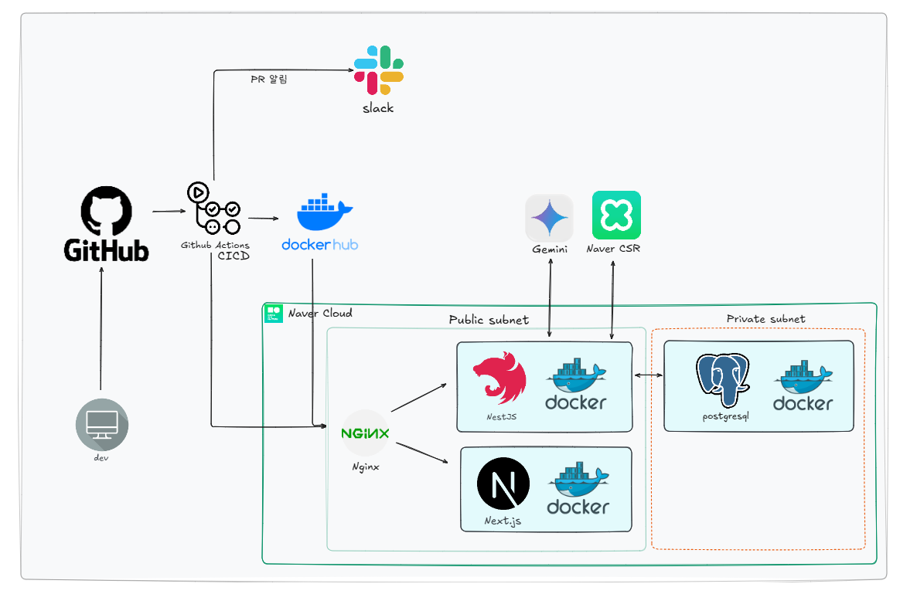

<br><br>
<p align="center"> 
 CS 개념을 직접 말로 설명하며 수동적인 암기에서 벗어나 
</p>

<p align="center">
스스로 사고하고 학습하는 방법을 익히도록 돕는 서비스, <strong>CS 뽁뽁</strong>입니다.
</p>

---

### 🎯 프로젝트

| 기능                         | 설명                                                   | 핵심 목적                   |
| ---------------------------- | ------------------------------------------------------ | --------------------------- |
| 🗣 말하기 연습               | CS 퀴즈에 대해 음성 답변하고, 이에 대한 AI 피드백 제공 | 개념을 자신의 언어로 구조화 |
| ✅ 체크리스트 자가진단       | 자신이 답한 내용을 스스로 점검                         | 자신을 돌아보며 빈틈을 발견 |
| 🤖 AI 피드백                 | 누락 개념 강조, 연관 개념 및 꼬리 질문 생성            | 답변 보완 및 사고 확장 유도 |
| 🔥 몸풀기 퀴즈 (객관식)      | 말하기 전 관련 개념을 빠르게 점검                      | 사전 개념 활성화            |
| 🔥 몸풀기 퀴즈 (주관식 카드) | 답을 생각 후 카드 뒤집기로 체크리스트 확인             | 사전 개념 활성화            |
| 📊 학습 리포트               | 취약 분야 분석, 활동 기록 시각화, 복습 대상 정리       | 학습 기록 정리              |

## 🧑‍🤝‍🧑 팀원 구성

|                          류지수                          |                           박혜린                            |                            정석찬                             |                         지은미                          |
| :------------------------------------------------------: | :---------------------------------------------------------: | :-----------------------------------------------------------: | :-----------------------------------------------------: |
|  |  |  |  |
|         [@sw-dev-j](https://github.com/sw-dev-j)         |       [@mangoooooo1](https://github.com/mangoooooo1)        |      [@Standard-Chan](https://github.com/Standard-Chan)       |         [@jum0624](https://github.com/jum0624)          |

---

# Tech Stack

### Backend

 
 


### Frontend

 
 


### CI/CD, Infra

 


### 협업 도구

 

---

## ☁ Infra Architecture



---

## 🚀 Run (Dev Environment)

### 1. env 파일 생성

**frontend/.env**

```
API_BASE_URL=http://localhost:8080/api
NEXT_PUBLIC_API_BASE_URL=http://localhost:8080/api
```

**backend/.env**

```
# =========================
# STT & AI
# =========================
GEMINI_API_KEY=Google_Gemini_Key
NAVER_CLOVA_CLIENT_ID=your_clova_id
NAVER_CLOVA_CLIENT_SECRET=your_clova_secret

# =========================
# DATABASE (docker-compose.dev 기준)
# =========================
DB_HOST=postgres
DB_PORT=5432
DB_USERNAME=postgres
DB_PASSWORD=root
DB_DATABASE=csbokbok_db

# =========================
# LOGGER
# =========================
LOG_LEVEL=debug
LOG_DIR=/app/logs
LOG_TO_FILE=false
```

### 2. 개발용 컨테이너 실행

```
docker compose -f docker-compose.dev.yml up --build
```

### 3. 접속

- Frontend → http://localhost:3000
- Backend → http://localhost:8080
- PostgreSQL → localhost:5432

### 4. 종료

```
docker compose -f docker-compose.dev.yml down
```

---
