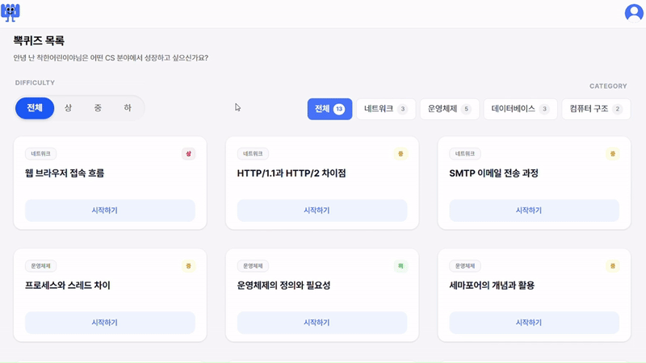
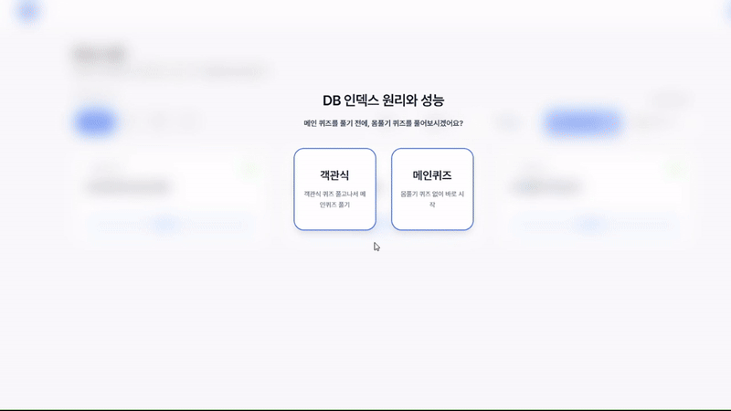
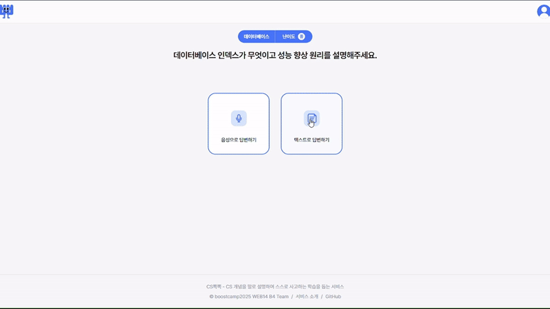
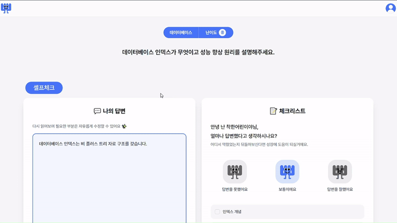
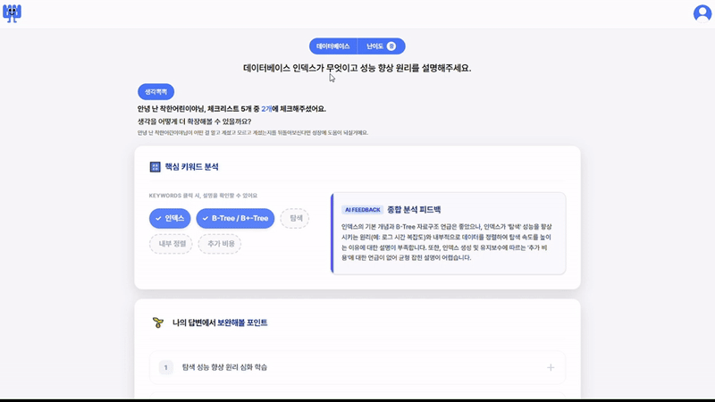
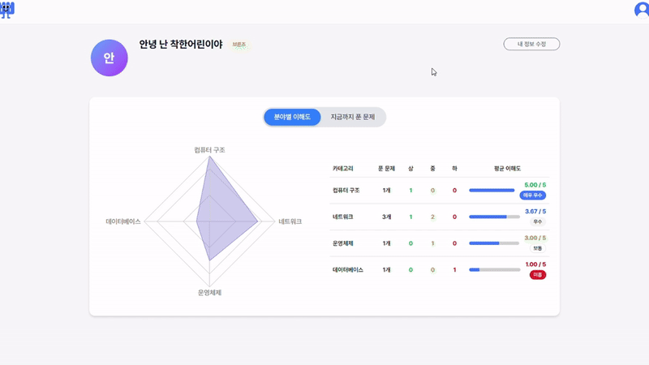
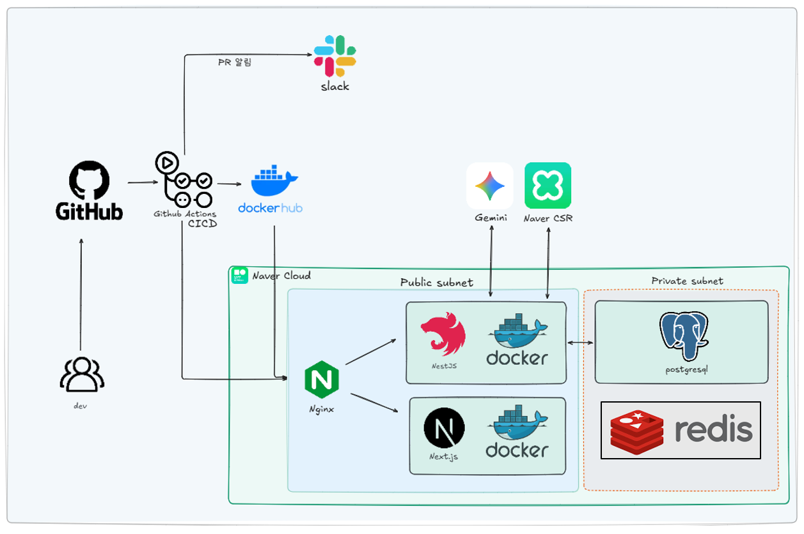

<br><br>

<h3 align="center""> 
    CS 개념을 말로 설명하며, 스스로 사고하는 학습을 돕는 서비스,
</h3>
<p align="center">
    <a href="https://git.io/typing-svg">
        
    </a>
</p>

<br><br>

<p align="center">
    <a href="https://github.com/boostcampwm2025/web14-B4/wiki">
        
    </a>
    &emsp;
    <a href="https://csbbokbbok.duckdns.org/">
        
    </a>
</p>

<div align="center">

<table>
  <tr>
    <td align="center"><a href="https://github.com/boostcampwm2025/web14-B4/wiki#-주요-기능-소개">🎯 주요 기능 소개</a></td>
    <td align="center"><a href="https://github.com/boostcampwm2025/web14-B4/wiki/개발환경-세팅">🛠 개발 환경 세팅</a></td>
  </tr>
  <tr>
    <td align="center"><a href="https://github.com/boostcampwm2025/web14-B4/wiki/시스템-아키텍처">🔧 시스템 아키텍처</a></td>
    <td align="center"><a href="https://github.com/boostcampwm2025/web14-B4/wiki/API-명세서">📄 API 명세서</a></td>
  </tr>
  <tr>
    <td align="center"><a href="https://github.com/boostcampwm2025/web14-B4/wiki/ERD-설계">💾 ERD 설계</a></td>
    <td align="center"><a href="https://github.com/boostcampwm2025/web14-B4/wiki#-기술문서">📚 기술 문서</a></td>
  </tr>
</table>

</div>

<br><br>

### ❓ CS 뽁뽁이 뭔가요?

> CS 뽁뽁은 암기 중심의 CS 학습에서 벗어나,  
>  **생각하고 설명하며 성장하는** CS 학습 경험을 제공하는 서비스입니다.
>
> CS 뽁뽁은 단순히 문제와 정답을 제공하는 서비스가 아닙니다.  
>  대신 사용자가
>
> - 자신의 언어로 개념을 꺼내 말하고,
> - 체크리스트와 자가 진단을 통해 논리의 빈틈을 점검하며,
> - 핵심 키워드 분석과 사고를 확장하는 AI 피드백을 통해 학습을 이어가도록 설계되었습니다.
>
> CS 뽁뽁은  
>  **"표면적인 이해에 머문 지식"을 "설명할 수 있는 지식"으로 바꾸는 학습 경험**을 제공합니다.

---

## 🎯 주요 기능 소개

| 기능                    | 설명                                                   | 핵심 목적                   |
| ----------------------- | ------------------------------------------------------ | --------------------------- |
| 🗣 말하기 연습          | CS 퀴즈에 대해 음성 답변하고, 이에 대한 AI 피드백 제공 | 개념을 자신의 언어로 구조화 |
| ✅ 체크리스트 자가진단  | 자신이 답한 내용을 스스로 점검                         | 자신을 돌아보며 빈틈을 발견 |
| 🤖 AI 피드백            | 누락 개념 강조, 연관 개념 및 꼬리 질문 생성            | 답변 보완 및 사고 확장 유도 |
| 🔥 몸풀기 퀴즈 (객관식) | 말하기 전 관련 개념을 빠르게 점검                      | 사전 개념 활성화            |
| 📊 학습 리포트          | 취약 분야 분석, 활동 기록 시각화, 복습 대상 정리       | 학습 기록 정리              |

## 🚀 주요 기능 상세

### 1. 뽁퀴즈 목록

- 학습하고자 하는 CS 퀴즈를 선택합니다.
- 난이도/카테고리별로 필터링하여 퀴즈를 선택할 수 있습니다.
  <br><br>
  

### 2. 몸풀기 퀴즈

- 메인퀴즈(말하기)를 풀기 전, 몸풀기 문제로 개념의 감을 잡아볼 수 있습니다.
- **객관식 퀴즈 제공** : 4지선다형으로 가볍게 풀면서 개념을 쏙쏙 익혀보세요 😊
  <br><br>
  

### 3. 말하기 연습 (메인 퀴즈)

- 퀴즈에 대해 직접 말로 답변하며, 개념을 자신의 언어로 설명하는 연습을 돕는 기능입니다.
- STT 기술을 활용하여 사용자의 음성 답변을 텍스트로 변환합니다.
- **텍스트 답변 모드 제공** : 말하기가 어렵거나 부담될 경우, 텍스트로도 답변할 수 있습니다.
- **미러링 기능** : 말하기 답변 중 비디오 녹화를 통해, **자신의 말하는 모습을 다시 보며 스스로 점검할 수 있습니다.**
  <br><br>
  

## 4. 체크리스트 자가진단

- 체크리스트를 통해, 나의 답변을 기준으로 이해도를 스스로 점검할 수 있습니다.
- **나의 답변** : 음성 또는 텍스트로 제출한 답변을 확인할 수 있습니다. 필요한 부분은 자유롭게 수정할 수 있습니다.
- **체크리스트 제공** : 메인 퀴즈에 대한 체크리스트를 제공하여 답변에 대한 이해도를 자가진단 해볼 수 있습니다.
  <br><br>
  

### 5. 생각뽁뽁 (AI 피드백)

- 핵심 개념을 더 깊이 학습 할 수 있도록 보완 포인트와 꼬리 질문을 제공합니다.
- **AI 피드백 제공** : 답변과 핵심 키워드를 기반으로 AI 종합 분석 피드백을 확인할 수 있습니다.
  <br><br>
  

### 6. 학습 리포트

- 풀었던 퀴즈에 대한 이해도와 진행률을 그래프로 확인할 수 있습니다.
- 풀었던 퀴즈를 중요도 별로 모아볼 수 있고, AI 피드백을 다시 볼 수 있습니다.
  <br><br>
  

---

## Tech Stack

### Backend

<p> 
     
     
    
</p>

### Frontend

<p> 
     
     
    
</p>

### CI/CD, Infra

<p>
     
    
    
    
</p>

### 협업 도구

<p>
     
    
</p>

---

## ☁ Infra Architecture



---

## 🚀 Run (Dev Environment)

### 1. env 파일 생성

**frontend/.env**

```
# 프론트엔드 API URL 설정 (docker + nginx 사용)
# API_BASE_URL=http://backend:8080/api
# NEXT_PUBLIC_API_BASE_URL=/api

NODE_ENV=production

# local test용
API_BASE_URL=http://localhost:8080/api
NEXT_PUBLIC_API_BASE_URL=http://localhost:8080/api

# [Naver OAuth - Frontend]
NEXT_PUBLIC_NAVER_CLIENT_ID=
NEXT_PUBLIC_NAVER_REDIRECT_URI=http://localhost:3000/auth/callback/naver
```

**backend/.env**

```
# dev
DB_HOST=localhost
DB_PORT=5432
DB_USERNAME=
DB_PASSWORD=
DB_DATABASE=

NAVER_CLOVA_SPEECH_INVOKE_URL=
NAVER_CLOVA_SPEECH_SECRET_KEY=
NAVER_CLOVA_SPEECH_DEFAULT_LANG=ko-KR

# [Naver OAuth - Backend]
NAVER_CLIENT_ID=
NAVER_CLIENT_SECRET=

# [Redis]
REDIS_HOST=localhost
REDIS_PORT=6379
REDIS_PASSWORD=

#[BE] JWT
JWT_SECRET=

#[BE] LOG
LOG_LEVEL=debug
LOG_DIR=logs
LOG_TO_FILE=false

NODE_ENV=production
```

### 2. 개발용 컨테이너 실행

```
docker compose -f docker-compose.dev.yml up --build
```

### 3. 접속

- `Frontend` → `http://localhost:3000`
- `Backend` → `http://localhost:8080`
- `PostgreSQL` → `localhost:5432`

### 4. 종료

```
docker compose -f docker-compose.dev.yml down
```

---

## 🧑‍🤝‍🧑 팀원 구성

|                          류지수                          |                           박혜린                            |                            정석찬                             |                         지은미                          |
| :------------------------------------------------------: | :---------------------------------------------------------: | :-----------------------------------------------------------: | :-----------------------------------------------------: |
|  |  |  |  |
|         [@sw-dev-j](https://github.com/sw-dev-j)         |       [@mangoooooo1](https://github.com/mangoooooo1)        |      [@Standard-Chan](https://github.com/Standard-Chan)       |         [@jum0624](https://github.com/jum0624)          |

---
